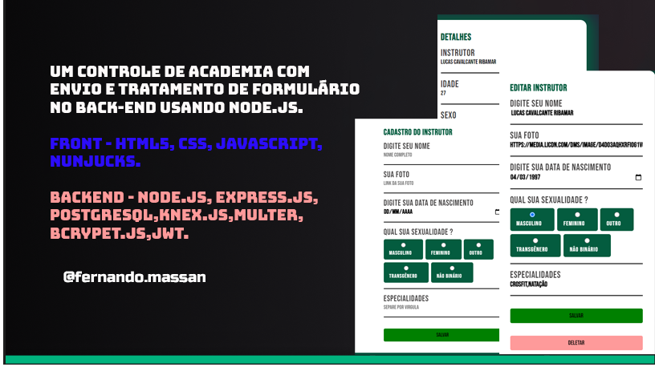

<h1 align="center">
  
</h1>

## 💻 Projeto

A aplicação **Academy Controll** É um controle de academia com envio e tratamento de formulário no back-end usando Node.js. É uma excelente aplicação que fiz para poder estudar mais o desenvolvimento Full Stack.

## ✨ Tecnologias

Esse projeto foi desenvolvido com as seguintes tecnologias e ferramentas:

## ✨ Frontend (Interface do Usuário)

-   [ ] **HTML5** - Estrutura da página web. 
-   [ ] **CSS3** - Estilização da interface, incluindo layouts e design responsivo.
-   [ ] **JavaScript (ES6+)** - Para interações dinâmicas na página.
-   [ ] **Nunjucks** - Usada para renderizar HTML de forma dinâmica no backend. 

## ✨ Backend (Lógica do Servidor)

-   [ ] **Node.js** - Plataforma utilizada para criar o servidor e a lógica de backend.
-   [ ] **Express.js** - Gerenciar rotas, middlewares e responder às requisições HTTP.
-   [ ] **PostgreSQL** - Utilizado para armazenar e gerenciar informações sobre os alunos.
-   [ ] **Knex.js** - Query builder utilizado para facilitar a interação com o banco de dados.

## :hammer_and_wrench: Features

-   [ ] Maaior Responsividade.
-   [ ] Integrar com boletos.
-   [ ] Sistema de ficha para usuarios.
-   [ ] Botão para alterar cor de fundo.

## 🚀 Executando o Projeto

-Após clonar o repositório, siga os passos abaixo para rodar o projeto em seu ambiente local:

# Usando npm
-npm install

# Agora so iniciar
-npm start

## 📸 Capturas de Tela -  Futuramente
  

